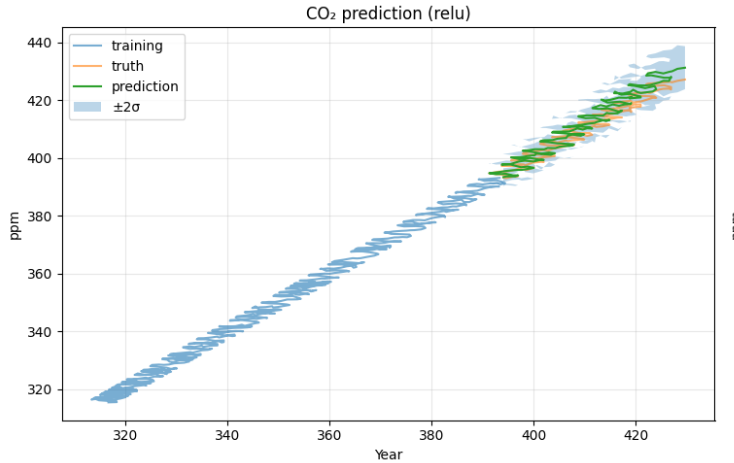
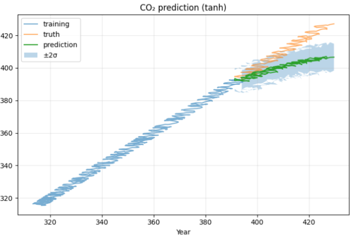
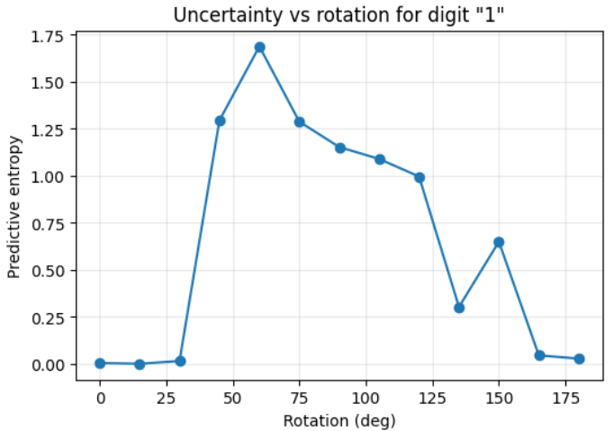
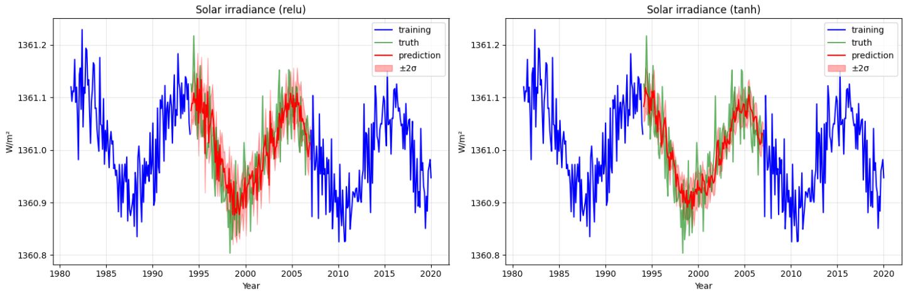
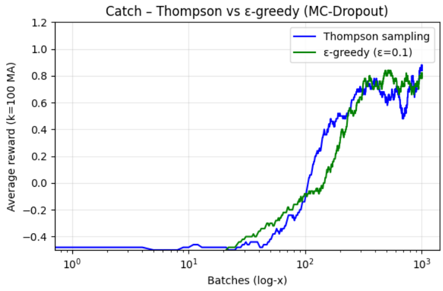

Here's a professional and concise `README.md` you can use for your GitHub repository. It avoids any mention of ChatGPT and assumes that all result figures are saved in the `imgs/` folder.

---

# Dropout as a Bayesian Approximation: Reproduction

This repository reproduces the core results of the ICML 2016 paper:

> **Dropout as a Bayesian Approximation: Representing Model Uncertainty in Deep Learning**
> *Yarin Gal & Zoubin Ghahramani, ICML 2016*

Our PyTorch implementation confirms that **MC-Dropout** provides a scalable, approximate Bayesian inference technique that yields calibrated epistemic uncertainty across a range of learning tasks.

## 📦 Features

* ✅ UCI-10 regression benchmark
* ✅ Mauna Loa CO₂ extrapolation
* ✅ Solar irradiance interpolation
* ✅ MNIST rotation uncertainty
* ✅ Thompson sampling in reinforcement learning

## 🔧 Setup

Install the dependencies:

```bash
pip install -r requirements.txt
```

## 🚀 Running the Experiments

Each section has an independent script under `experiments/`. You can run them individually:

```bash
python experiments/uci_regression.py
python experiments/co2_forecasting.py
python experiments/solar_irradiance.py
python experiments/mnist_uncertainty.py
python experiments/rl_catch.py
```

## 🖼️ Results

### UCI Regression

* Well-calibrated uncertainties across all 10 datasets.
* See: `imgs/uci_results_table.png`

### Mauna Loa CO₂ Forecasting

<p align="center">
  
  
</p>

* ReLU: high variance beyond training range (epistemic uncertainty).
* Tanh: flatter extrapolation consistent with bounded GP prior.

### MNIST Digit Rotation

<p align="center">
  
</p>

* Predictive entropy increases with rotation angle — uncertainty-aware behavior.

### Solar Irradiance Interpolation

<p align="center">
  
</p>

* Tanh saturates with tight bounds; ReLU yields larger uncertainty in missing intervals.

### Reinforcement Learning: Catch Game

<p align="center">
  
</p>

* Thompson sampling with MC-Dropout achieves faster convergence vs. ε-greedy.

## 📄 Paper Reference

If you use this code or results, please cite:

> Gal, Y., & Ghahramani, Z. (2016). Dropout as a Bayesian Approximation: Representing Model Uncertainty in Deep Learning. *ICML 33*.

## 👤 Author

**Adnan Karim**
EURECOM
📧 [adnan.karim@eurecom.fr](mailto:adnan.karim@eurecom.fr)

---

Let me know if you want a `requirements.txt` generated from your code.
